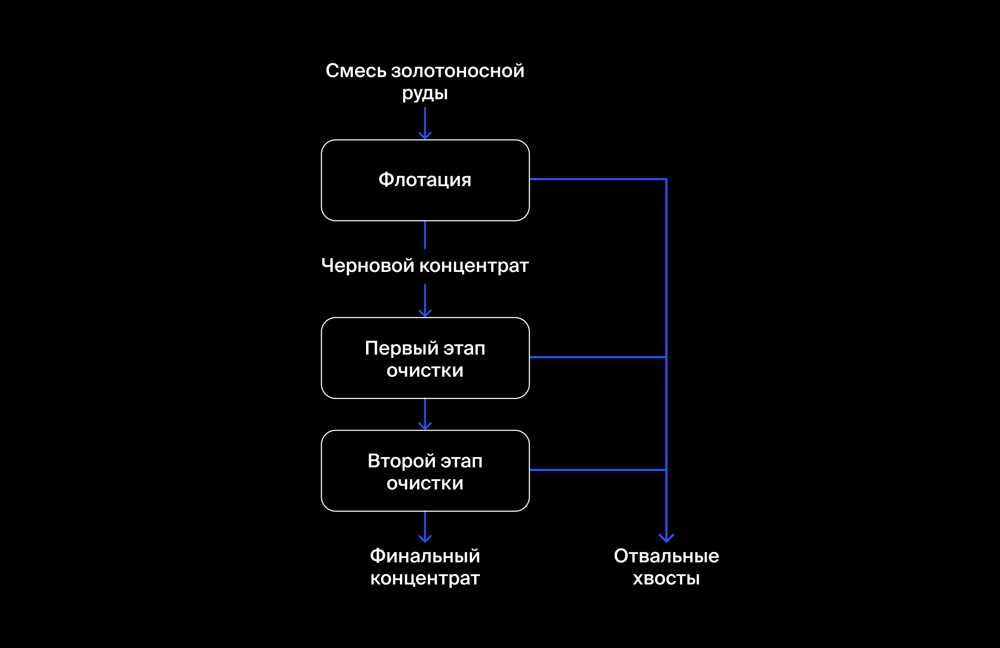

# Сборный проект 2

## Описание проекта

Подготовьте прототип модели машинного обучения для «Цифры». Компания разрабатывает решения для эффективной работы промышленных предприятий.
Модель должна предсказать коэффициент восстановления золота из золотосодержащей руды. В вашем распоряжении данные с параметрами добычи и очистки.
Модель поможет оптимизировать производство, чтобы не запускать предприятие с убыточными характеристиками.

## Описание технологического процесса

Этапы технологического процесса:
1. **Флотация**. Во флотационную установку подаётся смесь золотосодержащей руды. После обогащения получается черновой концентрат и «отвальные хвосты», то есть остатки продукта с низкой концентрацией ценных металлов.
На стабильность этого процесса влияет непостоянное и неоптимальное физико-химическое состояние флотационной пульпы (смеси твёрдых частиц и жидкости).

2. **Очистка**. Черновой концентрат проходит две очистки. На выходе получается финальный концентрат и новые отвальные хвосты.

## Описание данных

Признаки определяются в соответствии с этапом процесса по очистке, и выполняемой операцией.

### Термины используемые в данном технологическом процессе:

    Rougher feed — исходное сырье
    Rougher additions (или reagent additions) — флотационные реагенты: Xanthate, Sulphate, Depressant
        Xanthate **— ксантогенат (промотер, или активатор флотации);
        Sulphate — сульфат (на данном производстве сульфид натрия);
        Depressant — депрессант (силикат натрия).
    Rougher process (англ. «грубый процесс») — флотация
    Rougher tails — отвальные хвосты
    Float banks — флотационная установка
    Cleaner process — очистка
    Rougher Au — черновой концентрат золота
    Final Au — финальный концентрат золота

Параметры этапов

    air amount — объём воздуха
    fluid levels — уровень жидкости
    feed size — размер гранул сырья
    feed rate — скорость подачи

### Наименование признаков

Наименование признаков строится по следующей форме - **[этап].[тип_параметра].[название_параметра]**
Пример: **rougher.input.feed_ag**

Возможные значения для блока **[этап]**:

    rougher — флотация
    primary_cleaner — первичная очистка
    secondary_cleaner — вторичная очистка
    final — финальные характеристики

Возможные значения для блока **[тип_параметра]**:

    input — параметры сырья
    output — параметры продукта
    state — параметры, характеризующие текущее состояние этапа
    calculation — расчётные характеристики

## Поставленные задачи

- Подготовить данные;
- Провести исследовательский анализ данных;
- Построить и обучить модель, с прогнозированием двух величин:
   - эффективность обогащения чернового концентрата `rougher.output.recovery`
   - эффективность обогащения финального концентрата `final.output.recovery`

### Расчёт эффективности

Эффективность обогащения рассчитывается по формуле

где:
- *C* — доля золота в концентрате после флотации `rougher.output.concentrate_au`;
- *F* — доля золота в сырье/концентрате до флотации `rougher.input.feed_au`;
- *T* — доля золота в отвальных хвостах после флотации `rougher.output.tail_au`.

### Принятая метрика качества

В соответствии с условием данной задачи принимается метрика качества — sMAPE (англ. Symmetric Mean Absolute Percentage Error, «симметричное среднее абсолютное процентное отклонение»).

, где:

- ***y_i*** - Значение **целевого признака** для объекта с порядковым номером *i* в выборке, на которой измеряется качество.
- ***ŷ_i*** - Значение **предсказания** для объекта с порядковым номером i, например, в тестовой выборке.
- ***N*** - Количество объектов в выборке

